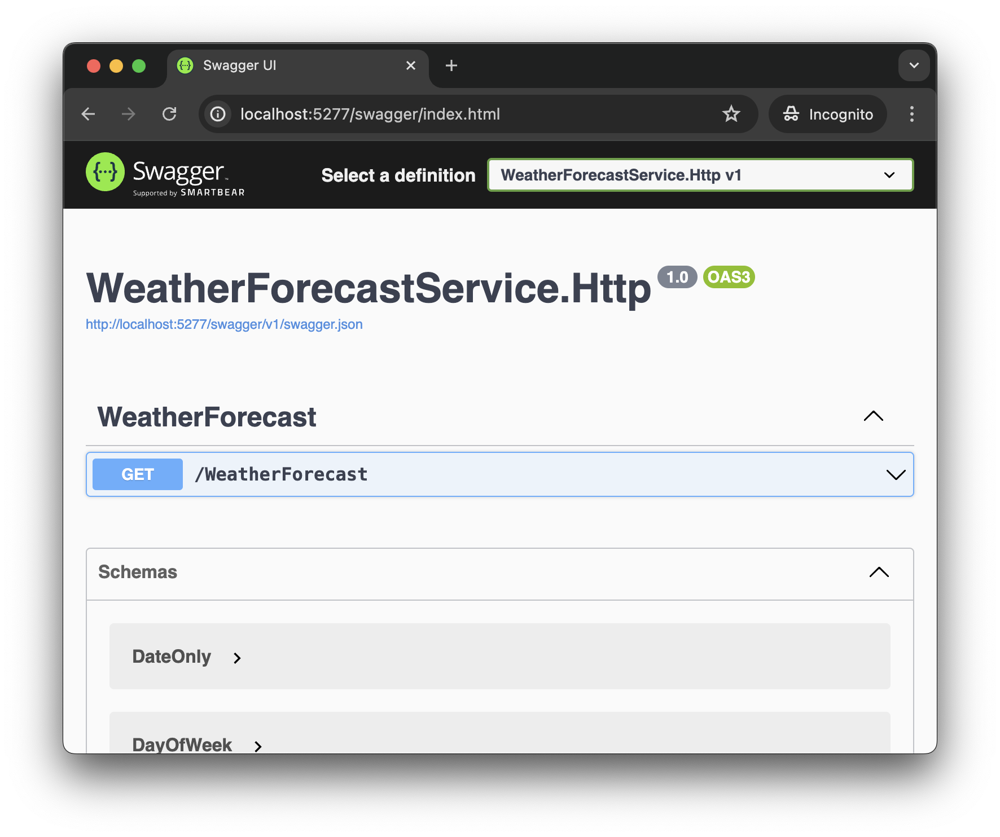
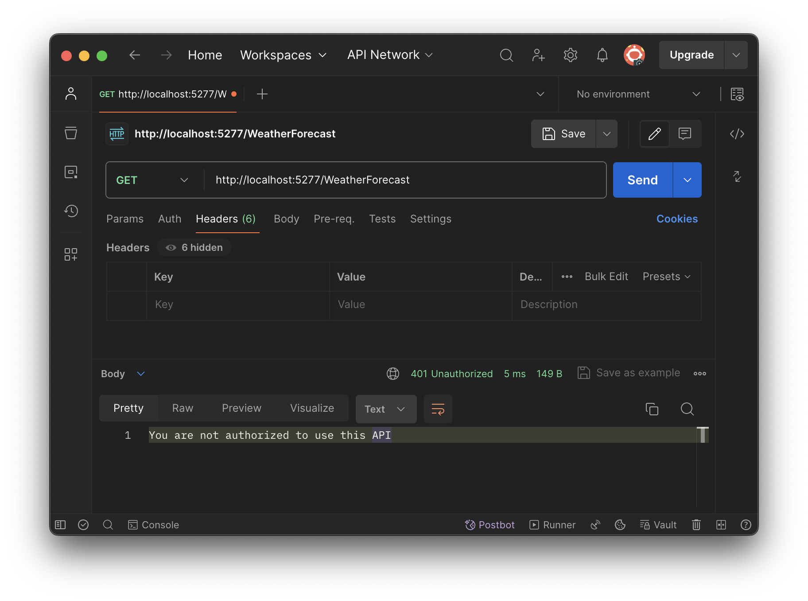
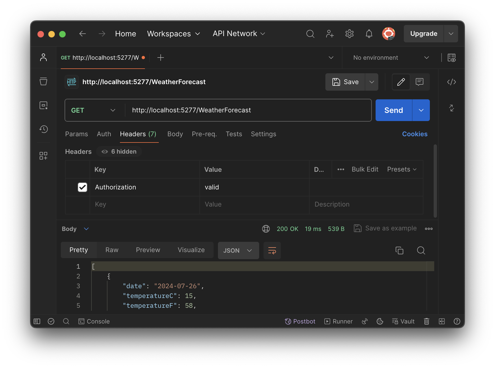

# gRPC Authorization Example

## Table of Contents

1. [Problem statement.](#problem-statement)
1. [Create empty HTTP-based weather forecast service.](#create-empty-http-based-weather-forecast-service)
1. [Create empty gRPC-based authorization service.](#create-empty-grpc-based-authorization-service)
1. [Implement token-based authorization logic in gRPC-based service.](#implement-token-based-authorization-logic-in-grpc-based-service)
1. [Add authorization into weather forecast service.](#add-authorization-into-weather-forecast-service)
1. [Testing how authorization works.](#testing-how-authorization-works)

### Problem statement

This solution demonstrates how to add token-based user authorization, managed by a separate gRPC service, to a mock weather forecast service.

Imagine, you have created a brand new web API service using CLI.

```bash
dotnet new webapi --use-controllers --name WeatherForecastService.Http
```

This service exposes a single `WeatherForecast` endpoint accessible to any user.



The goal is to make the endpoint accessible only to users who have a valid token. Additionally, we want to dedicate the authorization logic to the gRPS-based service.

### Create empty HTTP-based weather forecast service

Let's create an empty web API service via CLI by running the following command.

```bash
dotnet new webapi --use-controllers --name WeatherForecastService.Http
```

### Create empty gRPC-based authorization service

Let's create an empty gRPC service via CLI by running the following command.

```bash
dotnet new grpc --name AuthorizationService.Grpc
```

### Implement token-based authorization logic in gRPC-based service

First let's define a new authorization service by adding [authz.proto](./src/AuthorizationService.Grpc/Protos/authz.proto) file and reference it in [AuthorizationService.Grpc.csproj](/src/AuthorizationService.Grpc/AuthorizationService.Grpc.csproj#L11) file.

Next, we need to build the project to have new classes specified in proto automagically generated for us.

```bash
dotnet build
```

Now we need to implement `Authorize` method declared in [authz.proto](./src/AuthorizationService.Grpc/Protos/authz.proto#L10). Let's create [AuthzService.cs](./src/AuthorizationService.Grpc/Services/AuthzService.cs) file and write [Authorize](./src/AuthorizationService.Grpc/Services/AuthzService.cs#L14) method there. For the sake of simplicity, let's authorize users if the passed authorization token contains [valid](./src/AuthorizationService.Grpc/Services/AuthzService.cs#L25) substring.

Finally we need to map `AuthzService` in [Program.cs](./src/AuthorizationService.Grpc/Program.cs#L12) file.

### Add authorization into weather forecast service

Now let's make the weather service call the authorization service on every request and allow or deny access to its endpoint based on the authorization token passed in the request headers.

First we need to copy [Protos/authz.proto](./src/AuthorizationService.Grpc/Protos/authz.proto) file from `AuthorizationService.Grpc` into `Protos` subdirectory of `WeatherForecastService.Http` project and reference it in [WeatherForecastService.Http.csproj](./src/WeatherForecastService.Http/WeatherForecastService.Http.csproj#L20) file.

Build the project.

```bash
dotnet build
```

Add the following NuGet packages.

```
dotnet add package Grpc.Net.Client
dotnet add package Google.Protobuf
dotnet add package Grpc.Tools
```

Add [inline middleware](./src/WeatherForecastService.Http/Program.cs#L26) that validates authorization tokens by calling the authorization service.

We are done! 🎉🎉🎉

### Testing how authorization works

Let's run both projects and try calling `WeatherForecast` endpoint.

First let's call it without a token. As expected, the response code is `401 Unauthorized`.



Let's call it again specifying authorization token with `valid` value. The response code now is `200 Success`.



Don't forget to give ⭐️ if it was helpful.
